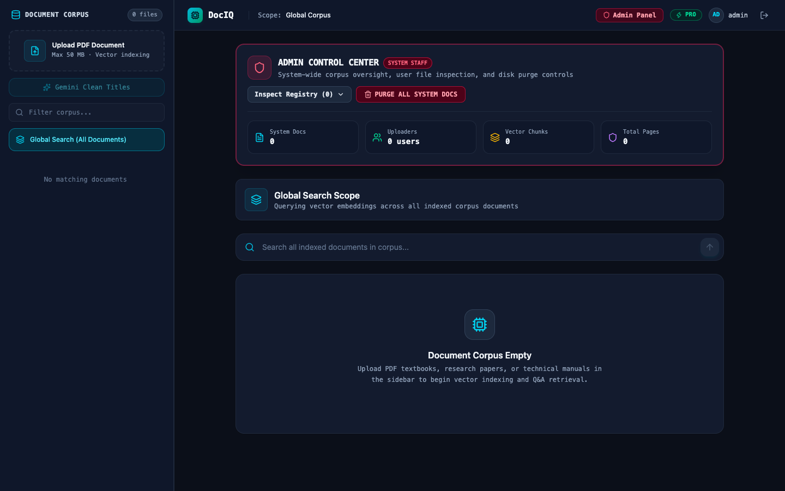
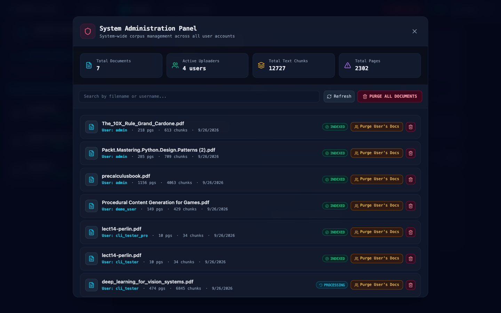
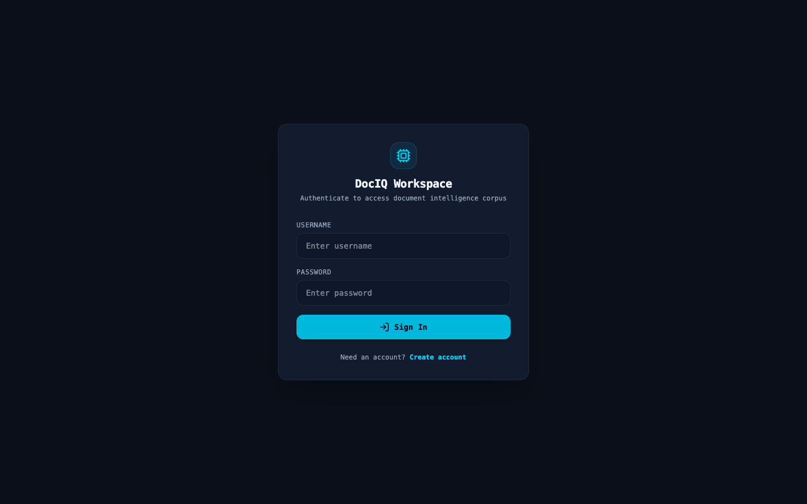
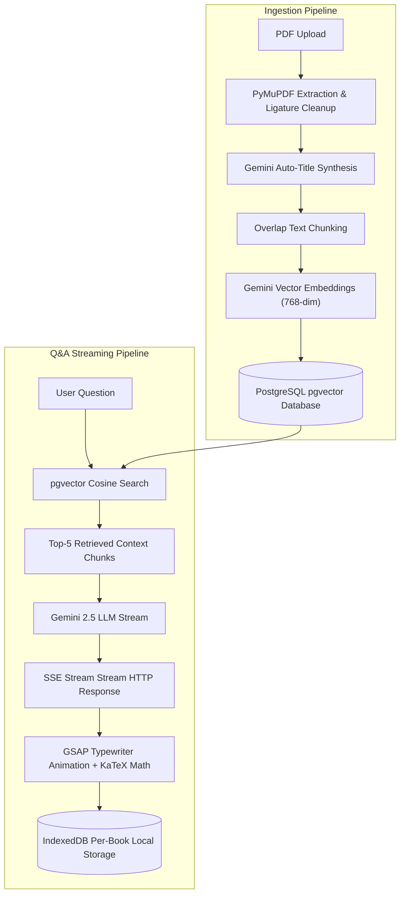

# AI Document Q&A (DocIQ) — Technical Document Intelligence Workstation

A production-grade Retrieval-Augmented Generation (RAG) workstation built with **Django REST Framework**, **PostgreSQL + pgvector**, **Google Gemini AI (New `google.genai` SDK)**, **GSAP Motion**, **IndexedDB**, and **React + Vite**.

DocIQ lets users upload multi-thousand page PDF textbooks, research papers, and technical manuals. It extracts text, generates vector embeddings, auto-cleans messy filenames with Gemini LLM, renders mathematical equations using KaTeX, and streams grounded answers real-time with page-level citations.

---

## 🚀 Key Features & Architectural Highlights

- 🤖 **Gemini Auto-Title Synthesis**: Uses Gemini LLM during indexing (or via one-click batch trigger) to clean rubbish filenames (e.g. `precalculusbook_v2_final.pdf` $\rightarrow$ `Precalculus (10th Edition)`).
- ⚡ **Real-Time SSE Answer Streaming**: Streams answers token-by-token over HTTP Server-Sent Events (`POST /api/questions/stream/`).
- ✍️ **ChatGPT-Style Simulated Typewriter**: Typewriter stream animation powered by **GSAP** & CSS blinking terminal block cursor (`▋`).
- 💾 **Per-Book IndexedDB Chat Storage**: Client-side conversation histories stored isolated per document (`doc_<id>` / `doc_global`) in browser IndexedDB. Zero chat database overhead.
- 🛡️ **Inline Admin Control Center**: Staff users (`admin` account) get a live dashboard banner and management panel for system-wide document inspection, single file deletion, user file purging, and platform-wide purges.
- 🧹 **Guaranteed Physical Disk & Vector Cascade Purge**: Custom `delete()` override on `Document` model guarantees physical PDF unlinking from disk (`media/documents/`) and cascaded `DocumentChunk` pgvector deletion.
- 📐 **KaTeX Math Notation**: Full LaTeX/KaTeX equation rendering for inline ($x^2 + y^2 = r^2$) and centered display math formulas.
- 🎨 **Dark Obsidian Slate & Electric Cyan Theme**: Distinctive visual design following anti-AI cliché principles (no decorative emojis, Anthropic terracotta copies, or bland SaaS cards).
- 🔑 **Tiered Dual API Key Routing**: Dual API key management (`GEMINI_FREE_API_KEY` vs `GEMINI_PRO_API_KEY`) with quota isolation and retry backoff.

---

## 📸 Application Visual Tour

### 1. Main Workspace Dashboard & Admin Control Center


### 2. System-Wide Admin Management Panel


### 3. Authentication Screen (Obsidian Slate Theme)


---


## ⚡ Quick Start & Credentials

### Default Admin Credentials
- **Username**: `admin`
- **Password**: `adminpass123`
- **Role**: `PRO Tier Staff Admin`

### Running Server Links
- 💻 **Frontend Web App**: [http://localhost:5173](http://localhost:5173)
- ⚙️ **Backend REST API**: [http://127.0.0.1:8000/api/](http://127.0.0.1:8000/api/)

---

## 🛠️ How to Start the Application

### Prerequisites

1. **PostgreSQL** running locally with `pgvector` extension:
   ```bash
   brew install pgvector
   psql -U kalmin -d postgres -c "CREATE DATABASE ai_doc_qa;"
   psql -U kalmin -d ai_doc_qa -c "CREATE EXTENSION IF NOT EXISTS vector;"
   ```

2. **Gemini API Keys**:
   Set your API keys in `backend/.env`:
   ```env
   GEMINI_API_KEY=your_gemini_api_key_here
   GEMINI_FREE_API_KEY=your_free_tier_key
   GEMINI_PRO_API_KEY=your_pro_tier_key
   ```

---

### Step 1: Django Backend Server

```bash
cd backend
source venv/bin/activate
python manage.py migrate
python manage.py runserver 8000
```

---

### Step 2: React Frontend Server

In a separate terminal window:

```bash
cd frontend
npm run dev
```

---

## 📡 API Reference Table

| Endpoint | Method | Auth | Description |
|----------|--------|------|-------------|
| `/api/auth/login/` | `POST` | Public | Obtain JWT token pair (`access`, `refresh`) |
| `/api/auth/register/` | `POST` | Public | Register new user account |
| `/api/auth/me/` | `GET` | Bearer | Retrieve current user profile & admin status |
| `/api/documents/` | `GET` / `POST` | Bearer | List or upload PDF documents |
| `/api/documents/<id>/` | `DELETE` | Bearer | Delete PDF file from server disk & database |
| `/api/documents/rename-all/` | `POST` | Bearer | Batch auto-rename document titles with Gemini |
| `/api/questions/stream/` | `POST` | Bearer | Real-time SSE streaming answer generation |
| `/api/documents/admin/list/` | `GET` | Admin | List all system documents across all users |
| `/api/documents/admin/<id>/` | `DELETE` | Admin | Delete any document system-wide |
| `/api/documents/admin/user/<id>/` | `DELETE` | Admin | Purge all documents belonging to a specific user |
| `/api/documents/admin/purge-all/` | `DELETE` | Admin | Purge all system-wide documents |

---

## 🏗️ Technical System Flow



---

## 📦 Tech Stack

- **Frontend**: React 19, Vite, Tailwind CSS v4, GSAP (GreenSock), Lucide Icons, KaTeX (`remark-math`, `rehype-katex`), Native IndexedDB (`idb.js`).
- **Backend**: Python 3.13, Django 5.1, Django REST Framework, SimpleJWT, PyMuPDF, Django Channels, WebSockets.
- **Database**: PostgreSQL 18 with `pgvector` similarity search.
- **AI Models**: Google GenAI SDK (`text-embedding-004` / `gemini-embedding-001` embeddings, `gemini-2.5-flash` / `gemini-3.5-flash-lite` LLM generation).
